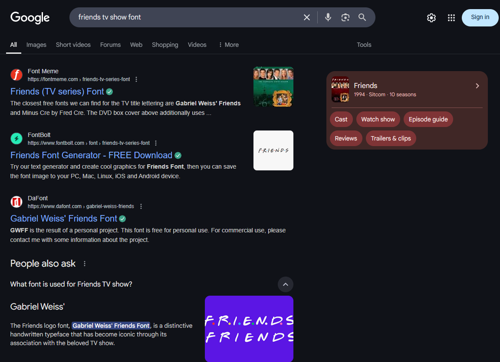
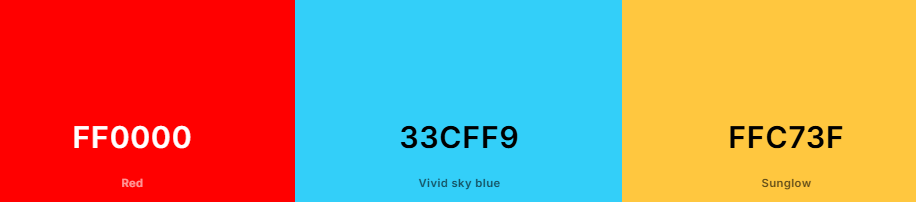
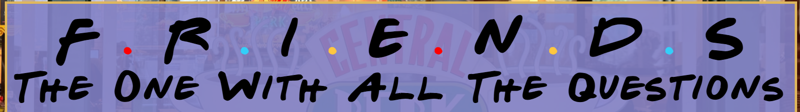
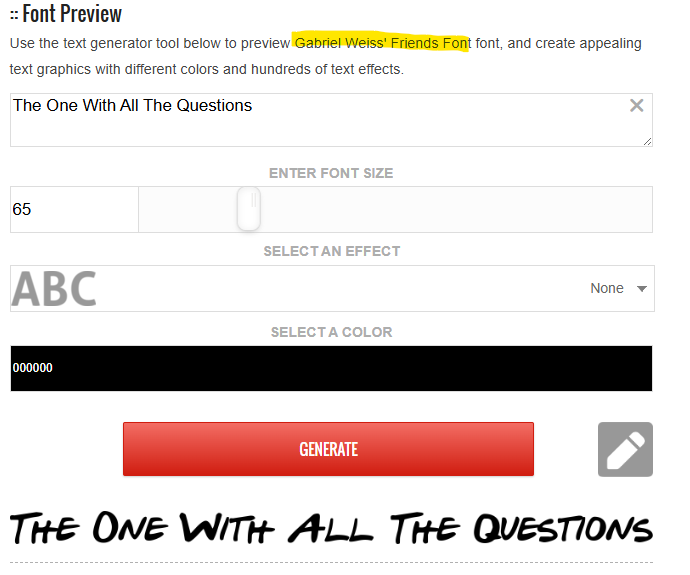
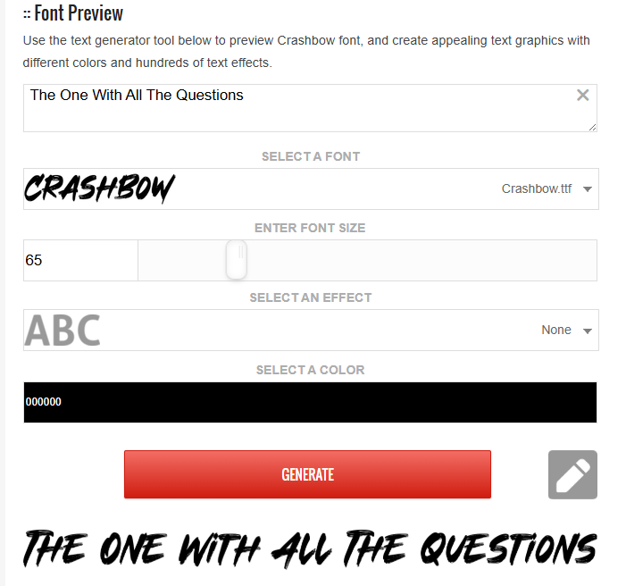
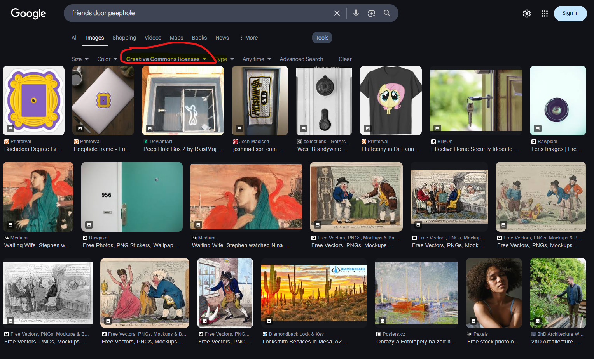
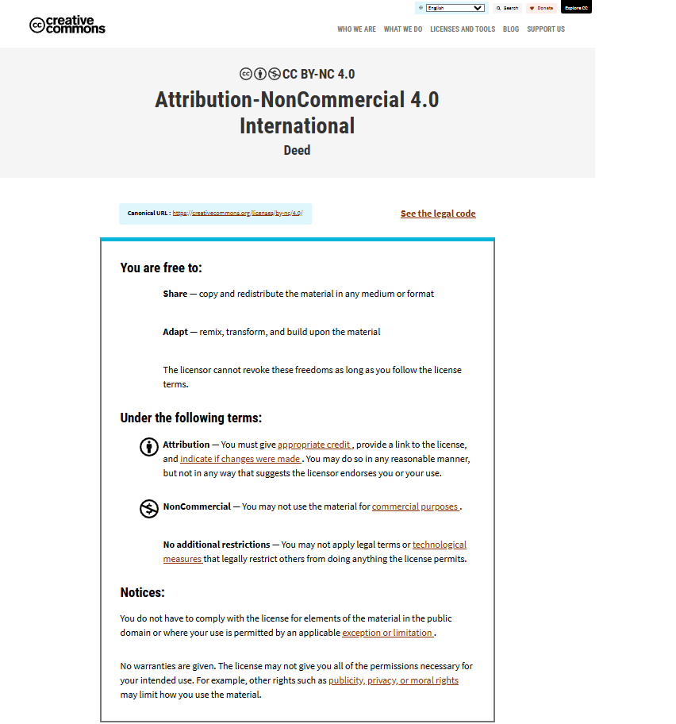
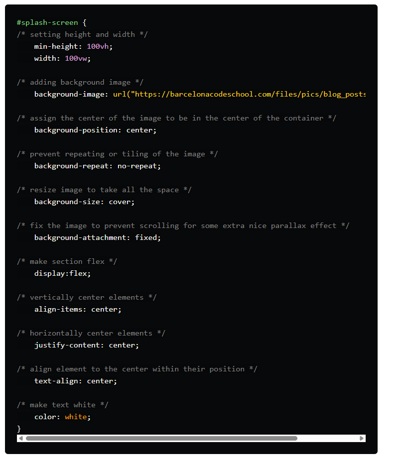

# The one with all the questions - 'Friends' interactive trivia website
# Milestone Project 2 - Interactive Front End Development

<h2 align="center"></h2>

# Table of Contents 

## Contents
1. [Introduction](#introduction)
2. [Live Site](#live-site)
3. [Repository](#repository)
4. [User Experience](#user-experience)
    * [Strategy](#strategy)
         + [Site Owner Goals](#site-owner-goals)
         + [Site Manager Goals](#site-manager-goals)
         + [User Stories](#user-stories)
         + [User Goals](#user-goals)
           + [Must Have](#must-have)
           + [Should Have](#should-have)
           + [Could Have](#could-have)
         + [User Expectations and Requirements](#user-expectations-and-requirements)
    * [Scope](#scope)
        + [Initial Stage Features](#initial-stage-features)
        + [Future Additions](#future-additions)
    * [Structure](#structure)  
        + [Wireframes](#wireframes)
   * [Skeleton](#skeleton)  
        + [Layout](#layout)
          + [Information Architecture](#infomation-architecture)
            + [Navigation Bar](#navigation-bar)
            + [Sub-navigation Bar](#sub-navigation-bar)
            + [Buttons](#buttons)
            + [Footer](#footer)
            + [Thank You Page](#thank-you-page)
            + [404 Error Page](#404-error-page)
   * [Surface](#surface)
        + [Design](#design)
          + [Colour Scheme](#colour-scheme)
          + [Typography](#typography)
          + [Imagery](#imagery)
          + [Icons](#icons)
          + [Logo](#logo)
          + [Favicons](#favicons)
5. [Technologies Used](#technologies-used)
     + [Languages](#languages)
     + [Frameworks Libraries and Programmes](#frameworks-libraries-and-programmes)
       * [Creation](#creation)
       * [Testing](#testing)
       * [Images](#images)
       * [Miscellaneous](#miscellaneous)
6. [Testing and Validation](#testing-and-validation)
7. [Deployment](#deployment)
     + [GitHub Pages](#github-pages)
     + [Forking the GitHub Repository](#forking-the-github-repository)
     + [Making a Local Clone](#making-a-local-clone)      
8. [Credits](#credits)
     + [Content](#content)
     + [Code](#code)
     + [Acknowledgments](#acknowledgments)
9. [Developer Comments](#developer-comments)
10. [Disclaimer](#disclaimer)

  
# Introduction
* 

* This is my second milestone project for the Code Institute Level 5 Diploma in Web Application Development.

# Live Site 
[The live site can be viewed here]

# Repository
[The project repository can be viewed here]

# User Experience
  ## Strategy
  ### Site Owner Goals
  * To 

  ### Site Manager Goals
  * For

  ### User Stories
  These can be found in my GitHub [project board]( for this repository.

  ### User Goals
  ### Must Have
  * To 

  ### Should Have
  * To 

  ### Could Have
  * To 

### User Expectations and Requirements
* A

# Scope
## Initial Stage Features

## Future Additions

# Structure 
## Wireframes
<
# Skeleton
## Layout
### Information Architecture

### Navigation Bar 

### Sub-navigation Bar
* TEMPLATE FOR IMAGE THAT IS OPEN BY DEFAULT

<h3 align="center">Google search results</h3>

### Buttons

### Footer 

### Thank You Page
 

### 404 Error Page

# Surface
 ## Design
 ### Colour Scheme
 * The colours used in the site were taken from the colours of the inside of Monica Geller's front door 
 * Background colours ......
 * Font colouurs .......

 ### Site Title Colour Scheme
 * The title of the site is 'Friends', with the subtitle of 'The One With All The Questions'.
 * The coloured dots which appear between each letter in the word 'Friends' in the opening credits of the show, are an integral part of the Friends brand. They appear on official merchandise, on DVD covers and on Netflix thumbnails. The colours of the dots match the colours of umbrellas held by the 6 main cast members in the opening credits of the pilot episode (Joey and Chandler hold blue umbrellas, Phoebe and Monica's umbrellas are yellow, and Ross and Rachel each hold a red umbrella). Therefore it was crucial to include them in the title of the website as avid Friends fans will expect to see them.
 * The colours used for the dots were generated by [Coolors](https://coolors.co/). I used their [Color Picker tool](https://coolors.co/ffc73f) on a screenshot of the opening credits of an episode of Friends to pick out colours which match those of the original dots as closely as possible (red, blue and yellow).
    

          
Dot Colours

           
     

     

          
Coloured dots in the site title (desktop)

           
     

 ### Typography
  * The Font used in the opening credits of 'Friends' is very distinctive and easily recognisable - especially to avid fans of the show. Therefore I knew I needed to use a font as close as possible to the original to make the site appealling to Friends fans. I used [Google](https://www.google.co.uk/) to research which font was the closest match. The results showed that this was Gabriel Weiss' Friends Font. I downloaded this font from [Font Meme](https://fontmeme.com/fonts/gabriel-weiss-friends-font-font/).
     

          
Google search results for Friends TV show font

           
     

     

          
Gabriel Weiss' Friends Font

           
     

* the font [Crashbow](https://fontmeme.com/fonts/crashbow-font/) - also from Font Meme, is the first fallback font, in case Gabriel Weiss' Friends Font fails to load correctly. It was selected due to its similarity to Gabriel Weiss' Friends Font.
     

          
Crashbow font

           
     

* Two further fallback fonts have been set, in case neither Gabriel Weiss' Friends Font or Crashbow load correctly. The second fallback is Cursive, with Serif as the third and final fallback font.

 

   ### Imagery

   
  ### Image Styling
   

### Icons

### Logo
* [Printerval](https://printerval.com/peephole-frame-friends-sticker-sticker756055-peephole-frame-p797344) - was used to source the image of the peephole frame from the back of Monica's front door. The image was found via a [Google](https://www.google.co.uk/) image search with results set to 'Creative Commons licenses'. This image was then used as the site's logo.
     

          
Google image search for 'friends door peephole' with results set to 'Creative Commons licenses'

           
     

     

          
Explanation of Creative Commons licenses

           
     

* For convenience, clicking the logo on the navbar will ..........

### Favicons
* The favicon was generated using [Favicon.io](https://favicon.io/). 
* The favicon is the peephole frame logo.

# Technologies Used
## Languages
* [HTML5](https://en.wikipedia.org/wiki/HTML5)
* [CSS3](https://en.wikipedia.org/wiki/CSS)
* [JavaScript](https://en.wikipedia.org/wiki/JavaScript)

## Frameworks Libraries and Programmes
 ### Creation
  * [Visual Studio Code](https://code.visualstudio.com/) – was the code editor used.
  * [Git](https://git-scm.com/) – was used for version control.
  * [GitHub](https://github.com/) – was used to create and store the project repository and create the user stories project board.
  * [Font Meme](https://fontmeme.com/) – was used to choose and import the fonts used in the site. The specific fonts used are: 
     * [Gabriel Weiss' Friends Font](https://fontmeme.com/fonts/gabriel-weiss-friends-font-font/) - as the main font.
     * [Crashbow](https://fontmeme.com/fonts/crashbow-font/) - as a back-up font, due to its similarity to Gabriel Weiss' Friends Font.
  * [Font Awesome](https://fontawesome.com/) – was used to choose and import the icons used in the site.
  * [Canva](https://www.canva.com/) – was used to create the wireframes. 
  * [Bootstrap breakpoints](https://getbootstrap.com/docs/5.0/layout/breakpoints/) - these breakpoints defined by Bootstrap, were used when making the site responsive.
  * [Google Chrome Developer Tools](https://developer.chrome.com/docs/devtools/) – was used while building the project to test responsiveness, and for debugging.

  ### Testing
  * [W3C HTML Validator](https://validator.w3.org/) – was used to validate the HTML.
  *	[W3C CSS Validator](https://jigsaw.w3.org/css-validator/) – was used to validate the CSS.
  *	[WAVE Web Accessibility Evaluation Tools](https://wave.webaim.org/) – was used to test the site for accessibility.
  * [Google Chrome Developer Tools (Lighthouse feature)](https://developer.chrome.com/docs/lighthouse/overview) - was used to test the site for Performance, Accessibility, Best Practices and SEO.

  ### Images
 * [Pexels](https://www.pexels.com/) - was used to source the [Central Perk background image](https://www.pexels.com/photo/festive-central-perk-cafe-window-display-30500272/) used in the homepage of the site.
 * [Printerval](https://printerval.com/peephole-frame-friends-sticker-sticker756055-peephole-frame-p797344) - was used to source the image of the peephole frame from the back of Monica Gellar's front door which was used as the site's logo.
  * [Tinify](https://tinypng.com/) – was used to optimise all images.
  * [Canva](https://www.canva.com/) – was used to remove the background from the logo.
  * [Favicon.io](https://favicon.io/) – was used to generate the site’s favicon.
  * [Techsini](https://techsini.com/multi-mockup/) – was used to generate a mockup of the homepage on various screen sizes.
  * [Coolors](https://coolors.co/) – was used to generate the site’s colour scheme.
  * [WebAIM Contrast Checker](https://webaim.org/resources/contrastchecker/) – was used to test all colour combinations for accessibility.

 ### Miscellaneous 
 * [ChatGPT](https://openai.com/index/chatgpt/) – was used for proof-reading. 
 * [Google](https://www.google.co.uk/) - was the search engine used to conduct all online research.

# Testing and Validation
Please refer to [this file](TESTING.md) for details of the testing and validation undertaken.

# Deployment
## GitHub Pages
This site was deployed to GitHub pages. The steps to deploy a site are as follows:

* Log in to GitHub and navigate to the required repository.
* Navigate to the ‘Settings’ tab on the navbar at the top of the page.
* Navigate to ‘Pages’ on the menu on the left-hand side of the page.
*	Navigate to ‘Build and deployment’ and select ‘Deploy from a branch’ from the dropdown menu under source.
* Select ‘main’ and ‘root’ under branch and click save.
* The page will automatically refresh and a link to the deployed site will appear under ‘Deployments’ on the right-hand side of the page.

## Forking the GitHub Repository
* Log in to GitHub and navigate to the required repository.
* Navigate to the right-hand side of the page and click ‘Fork’. This is located in-line with your repository name underneath the nav bar. 
* Give the forked repository a name of your choosing.
* Amend the repository description if required.
* Tick ‘Copy the main branch only'.
*	Click the ‘Create fork’ button.
* You will now have a copy of the original repository in your GitHub account.

## Making a Local Clone
* Log in to GitHub and navigate to the required repository.
* Click on the ‘Code’ button at the top of the repository and copy the URL. 
* Open Git Bash in your IDE of choice and change the working directory to the location where you want the cloned directory.
* Type git clone, then paste the URL you copied earlier.
* Press enter. Your local clone will be created.

# Credits
## Content
* Warner Bros - Friends quotes and references
 
## Code
* [Code Institute Love Running walkthrough project](https://github.com/Code-Institute-Solutions/love-running-v3) :-
  - for the code for the social media links in the footer. 
  - for the code for the general styles used to push the footer to the bottom of the page. 
  - for the code for the responsive nav bar.
  - for help writing media queries.
* [This article by George.K for Dev.to](https://dev.to/bcncodeschool/aligning-elements-on-top-of-the-image-background-4kcf) - for the code to make the Central Perk hero image cover the entire background of the homepage.
     

          
Code from George.K for Dev.to

           
     

* [This article on Stack Overflow](https://stackoverflow.com/questions/27037500/css-make-every-letter-in-a-text-of-a-different-colour) - for help with making the dots in the 'Friends' title different colours. 

## Acknowledgments

# Developer Comments

# Disclaimer

This project is for educational purposes only and not for public use. It was created for the Code Institute assessed project for the 'Interactive Front End' module.  
 
Created by Lucy Kidner, 2025. 
