# The one with all the questions - 'Friends' interactive trivia website
# Milestone Project 2 - Interactive Front End Development

<h2>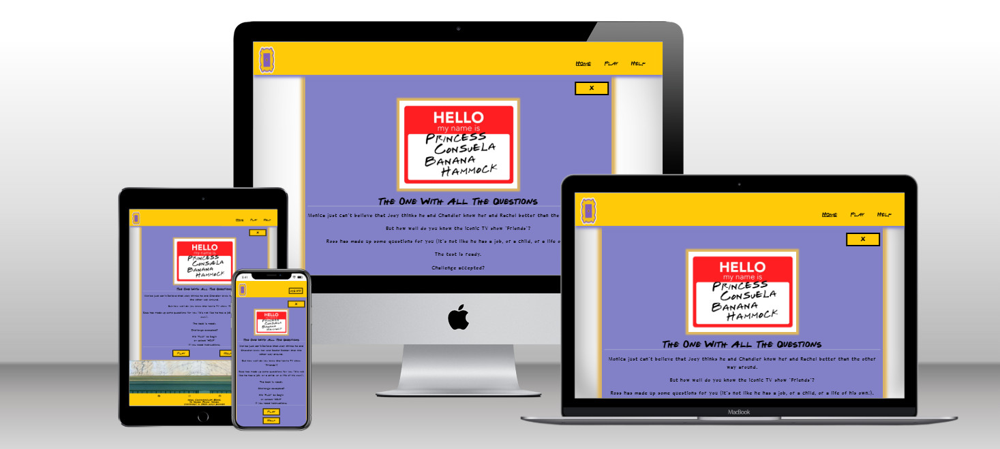</h2>

[View the live site here](https://lucyinthesky2111.github.io/the-one-with-all-the-questions/index.html)

# Table of Contents 

## Contents
1. [Introduction](#introduction)
2. [Live Site](#live-site)
3. [Repository](#repository)
4. [User Experience](#user-experience)
     + [Site Owner Goals](#site-owner-goals)
     + [Site Manager Goals](#site-manager-goals)
     + [User Stories](#user-stories)
          + [Must Have](#must-have)
          + [Should Have](#should-have)
          + [Could Have](#could-have)
     + [User Expectations and Requirements](#user-expectations-and-requirements)
5. [Features](#features)
      + [Initial Stage Features](#initial-stage-features)
           + [Navigation Bar](#navigation-bar)
           + [Footer](#footer)
           + [Navigation Buttons](#Buttons)
           + [Introduction Modal](#introduction-modal)
           + [Homepage](#homepage)
           + [Play Page](#play-page-colour-scheme)
           + [Help Page](#help-page)
           + [404 Error Page](#404-error-page)
      + [Future Additions](#future-additions)
6. [Wireframes](#wireframes)
7. [Design](#design)
     + [Colour Scheme](#colour-scheme)
     + [Typography](#typography)
     + [Imagery](#imagery)
     + [Logo](#logo)
     + [Favicons](#favicons)
8. [Technologies Used](#technologies-used)
     + [Languages](#languages)
     + [Frameworks Libraries and Programmes](#frameworks-libraries-and-programmes)
       * [Creation](#creation)
       * [Testing](#testing)
       * [Images](#images)
       * [Miscellaneous](#miscellaneous)
9. [Testing and Validation](#testing-and-validation)
10. [Deployment](#deployment)
     + [GitHub Pages](#github-pages)
     + [Forking the GitHub Repository](#forking-the-github-repository)
     + [Making a Local Clone](#making-a-local-clone)      
11. [Credits](#credits)
     + [Content](#content)
     + [Code](#code)
     + [Acknowledgments](#acknowledgments)
12. [Developer Comments](#developer-comments)
13. [Disclaimer](#disclaimer)

  
# Introduction
* As someone who has been a fan of Friends since they were a child, I wanted to create a quiz for other people who love the show.     
* The quiz is a timed question and answer game to enable fans to test their knowledge of the show. 
* All the Friends episodes have titles including ‘The One’ e.g. ‘The One with the Football’ etc. In keeping with this tradition, the website has the subtitle of ‘The One with all the Questions’. 
* As an added touch for Friends fans to appreciate, Friends quotes, references, and images relating to the show are placed throughout the site.  

* This is my second milestone project for the Code Institute Level 5 Diploma in Web Application Development.

# Live Site 
[The live site can be viewed here](https://lucyinthesky2111.github.io/the-one-with-all-the-questions/index.html)

# Repository
[The project repository can be viewed here](https://github.com/lucyinthesky2111/the-one-with-all-the-questions)

# User Experience
  ## Site Owner Goals
  * For the site to provide an enjoyable, fun and interactive quiz for fans of Friends to test their knowledge of the show. 
  * For the site to be accessible to all fans of Friends by including questions of varying difficulty levels, in order to accommodate all levels of knowledge. 
  * For the site to feature links to the site owner’s social media accounts so users can contact them and find out more about their work. 

  ## Site Manager Goals
  * For the HTML, CSS and JS code to be clear, logical, and contain explanatory comments in order to ensure the site is easy to update and maintain. 
  * For images to be downloaded to the site manager's computer, not hosted by an external site, to ensure images are always available for the user.  

  ## User Stories
  These can be found in my GitHub [project board](https://github.com/users/lucyinthesky2111/projects/9/views/1) for this repository.

  As a player of the game, these are the features I want to see ranked in order of importance:
  
  ### Must Have Features
  * Clear instructions as to how to play the game which are accessible from anywhere on the site (user story 2). 
  * Immediate visual feedback as to whether my answer is correct or incorrect for each question (user story 3). 
  * Facility to see my final score at the end of the game, so I can replay and try to beat it (user story 4). 
  * For there to be questions of varying difficulty levels, so I can participate regardless of my knowledge level (user story 5). 

  ### Should Have Features
  * Visual indication of my progress, showing my current stage of the game (user story 6). 
  * Facility to see my current score throughout the game (user story 7). 

  ### Could Have Features
  * A message along with my final score, which is different according to what score I achieve (user story 8). 
  * A time limit on each question, to add a small amount of pressure, and make the game more challenging and exciting (user story 9). 
  * The questions and possible answers appear in a random order each time I play to increase replay-ability (user story 10). 
  * Ability to filter questions by difficulty level (user story 11). 

## User Expectations and Requirements
* All user story 1 (must-have)
* To find the website easy to access and navigate on any screen size. 
* For the site to be fully accessible. 
* For the site to be engaging and visually appealing, including high quality images which are related to Friends. 
* For any external links to open in a new tab. 
* To find a navigation menu at the top of every page. 
* To find a footer at the bottom of every page. 
* To receive a custom 404 error page which links back to the Homepage, when trying to access an incorrect URL within the site. 

# Features
## Initial Stage Features
I decided that the following features were all ‘must haves’ or ‘should haves’ (refer to the [user stories](https://github.com/users/lucyinthesky2111/projects/9/views/1) for details) at the initial stage to ensure a ‘minimum viable product’.  

* Instructions on how to play. 
* Visual indication of how far the user has progressed through the game.   
* The ability to see whether the selected answer is correct or incorrect immediately after answering. 
* The ability for the user to track their score throughout the game, as opposed to only seeing their score at the end.  
* The ability for the user to also see their final score at the end of the game. 
* For there to be questions of varying difficulty, to allow all fans of Friends to play regardless of their knowledge level. 

I was able to successfully implement all of the initial stage features. 

## Looking at the initial stage features of each part of the project in turn: 

### Navigation Bar
* A responsive navigation bar is included on each page of the site, to allow the user to easily navigate between pages without having to go back to the homepage or rely on the browser forward and back buttons.  
* The nav bar is sticky so it is always visible at the top of the page when the user is scrolling the site. 
* The links on the nav bar are in black text which appear blue when the user hovers over them to maintain readability and accessibility. 
* The 'active' link i.e. the page the user is on, is underlined as a visual reminder. 
* The links on the nav bar appear as a horizontal list on larger screens and in a drop down menu on smaller screens. 
<h2>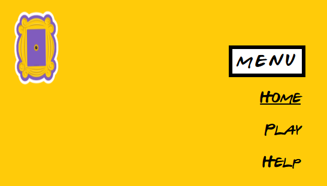</h2>Nav bar (Mobile and Tablet)
<h2>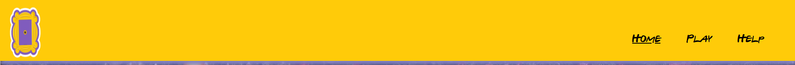</h2>Nav bar (desktop)

 
### Footer
* Each page features a footer which contains a copyright statement, and icons linking to social media pages. 
* Fans of Friends will also recognise the name and address featured in the footer as references from the show. 
* All the social media links open in a new tab.
* The footer is not sticky so it does not restrict the user's view of the bottom of the screen when scrolling.  
* The icons and text are black with an appropriate hover colour of blue to maintain readability and accessibility. 
<h2>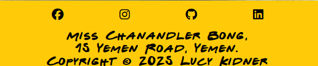</h2>Footer (Mobile)
<h2></h2>Footer (Desktop)

### Navigation Buttons 
* Navigation buttons are used throughout the site to link to other pages. 
* The buttons are consistent in style and colour across the site. 
* Buttons which sit against a purple background are yellow and buttons which sit against a yellow background are purple to ensure they stand out from the rest of the content.  
* All buttons regardless of their starting colour, change to white when clicked to maintain readability and accessibility.
* The text colour remains black when the button is clicked, to ensure the text remains legible against its background.
<h2>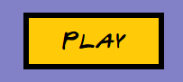</h2>Yellow button on purple background
<h2>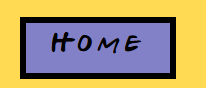</h2>Purple button on yellow background

### Introduction Modal
* The introduction modal introduces the game using a series of Friends references.  
* The introduction modal is only visible on the Homepage. 
* The modal gives the user the option to either proceed straight to the quiz (if they are a returning user or are confident they know how to play), or to navigate to the Help page where they can view instructions.  
* The introduction modal is displayed when the Homepage loads.
* The user can close the modal by clicking on the ‘X’ button in the top right-hand corner, or by clicking ‘Play’ or ‘Home’ to navigate to one of those pages.  
* Clicking ‘X’ displays the Homepage content which is located behind the modal. This content is described in the next section of this documentation. 
* After closing the modal, the user can access it again by clicking ‘Home’ from the nav bar. 
<h2>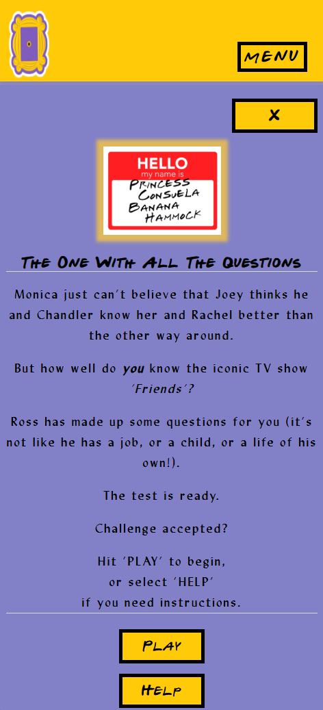</h2>Introduction Modal (Mobile)
<h2></h2>Introduction Modal (Desktop)

### Homepage
* The Homepage is the site’s landing page.  
* The Homepage features a full-page background image, which fans of the show will recognise as the outside of the famous ‘Central Perk’ coffeehouse. 
 * There is a partially transparent box over the centre of the image containing the site’s title and subtitle, which makes it immediately clear that the site is a quiz about the TV show Friends. 
 * The box border (and all box borders which appear on the site), do not have any border radius applied to them. This is because the Gabriel Weiss’ Friends Font suits stark square edges better than softer, rounder ones. 
 * A box shadow is applied to add texture and a layering effect, to add visual interest to the page, making it more aesthetically pleasing. 
<h2>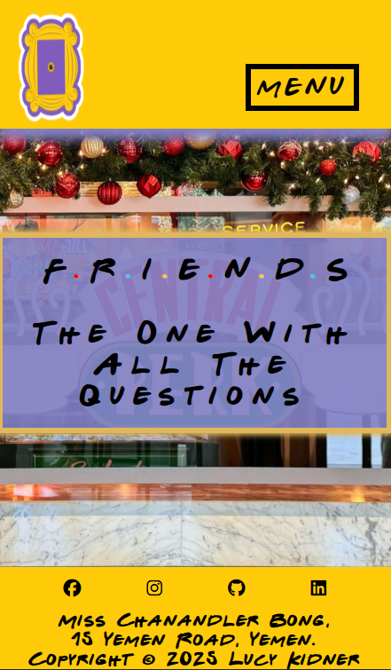</h2>Homepage (Mobile)
<h2>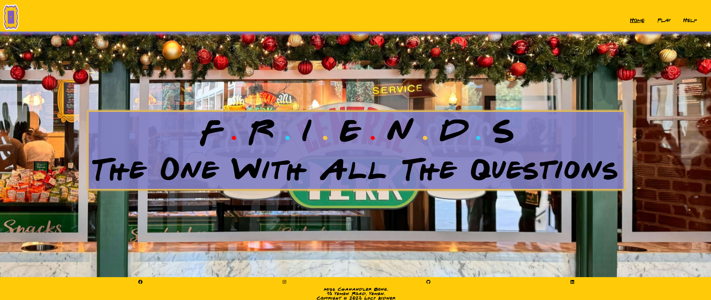</h2>Homepage (Desktop)

### Play Page
* The Play Page houses the quiz content. 
* The site’s title and subtitle appear at the top of the page. 
* Underneath the title and subtitle is a good luck message, which fans of the show will recognise as a quote from Phoebe Buffay. 
* The centre of the page features a box which houses the quiz content. For consistency, the box has no border radius and has a box shadow, as per the box on the Homepage.  
* At the bottom of the page are 3 images which Friends fans will recognise as relating to the show.  
* Corresponding quotes from 1 of the 6 main characters appear underneath each image on tablet and desktop screens only, to utilise the extra space these screens offer. 
* To prevent clutter and over-crowding on small screens, these quotes are hidden on mobile screens.  
* The remaining background space on this page is intentionally blank to prevent over-whelm and distraction, and to focus the user’s attention on the box which houses the quiz content.  
<h2>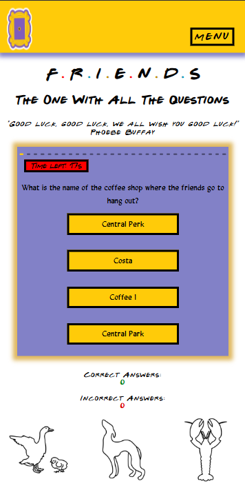</h2>Play Page (Mobile)
<h2>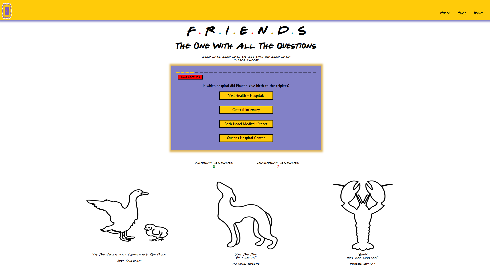</h2>Play Page (Desktop)

### Game play features of the Play Page

### Progress Bar
* There is a visual progress bar at the top of the questions and answers box which tracks the user’s progress through the game. 
* There is one bar for each of the 30 questions. 
* The bars are initially grey and change to yellow. 
* The bars change colour one at a time, each time a new question is started. 
* I chose this visual style of progress bar as I felt it was more visually interesting than simple text stating ‘question x of y’. 
<h2>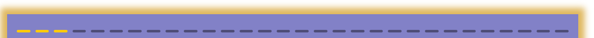</h2>Progress bar

### Timer  
* The game is a timed quiz in which the user is only given 30 seconds to answer each question. 
* The timer counts down the user’s remaining time. 
* The timer is encased in a red box with black text and a black border.  
* Red is used for the background colour to indicate urgency.
* To make it easy for the user to see the timer whilst ensuring the question and possible answers are not obstructed, the timer is conveniently located at the top-left of the quiz container, just underneath the progress bar.  
 <h2>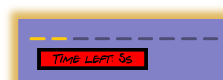</h2>Timer (styling and location)

 * The timer starts as soon as the user starts the question. 
 * If the user does not answer the question before the timer hits zero, the user will see a pop message telling them “Time’s up!” 
<h2>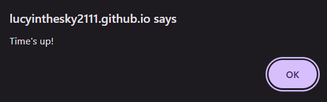</h2>Time's up message

* The game will then auto-advance to the next question so the user will not get another chance to answer. 
* That question will also be treated as having been answered incorrectly, and the users incorrect score tally will increment by 1 mark.  

### Correct and Incorrect Answers
* The user receives immediate feedback as whether their answer is correct or incorrect immediately after answering each question.  
* If the user answers correctly, the answer button they selected will turn green. 
<h2>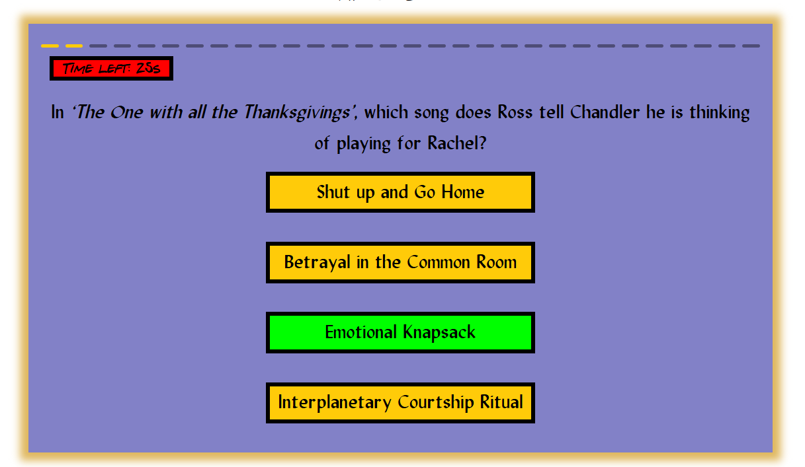</h2>Correct answer

* If the user answers incorrectly, the answer button they selected will turn red and the button housing the correct answer will turn green  
<h2>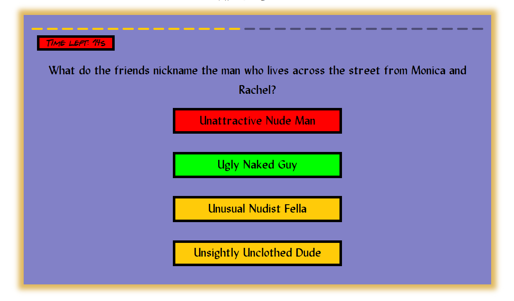</h2>Correct answer

### Running Scores Tally 
* The number of both correct and incorrect answers are tallied throughout the quiz so the user can keep track of their performance.  
* To match the highlight colours of the answer boxes, correct scores are tallied in green and incorrect scores are tallied in red.  
<h2>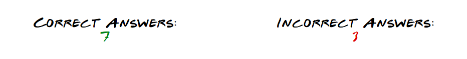</h2>Running scores tally

### Final Scores
* The user is notified of their final score at the end of the game. 
* The user receives a different Friends related message depending on the score they achieved. 
<h2>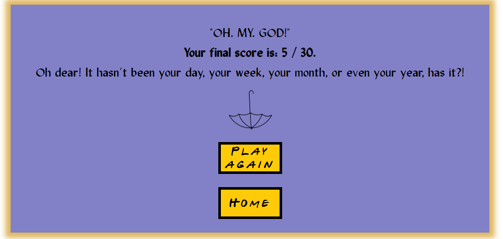</h2>Message for score 0-7
<h2>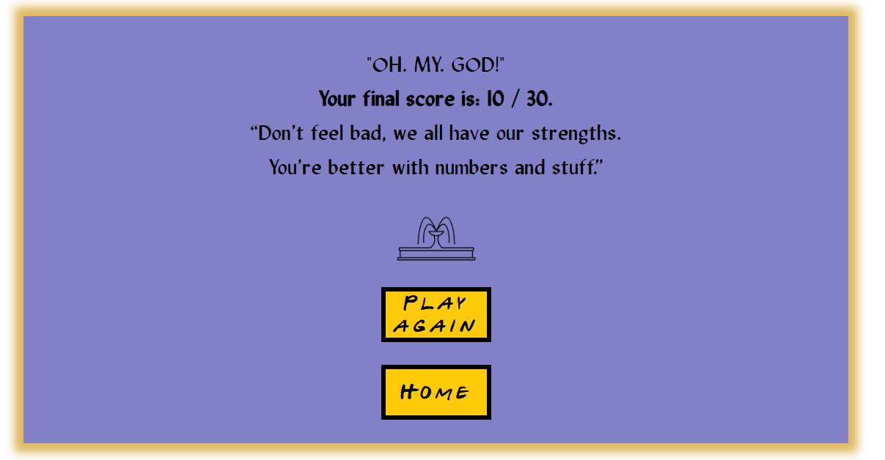</h2>Message for score 8-15
<h2>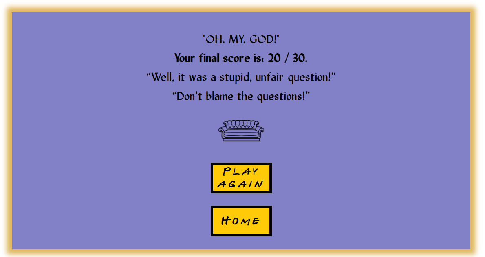</h2>Message for score 16-23
<h2>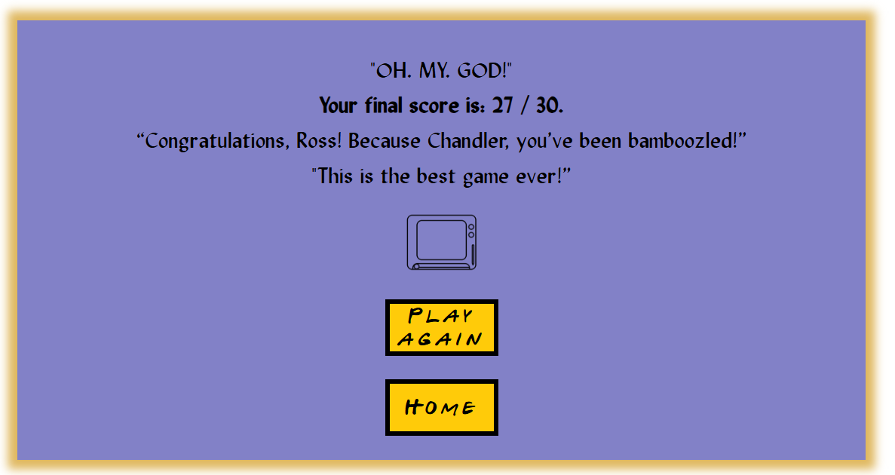</h2>Message for score 24-29
<h2>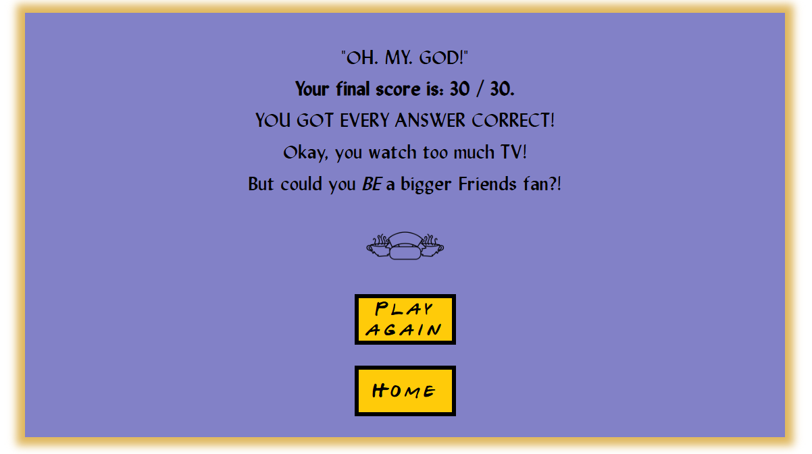</h2>Message for score 30

### Help Page
* The Help Page features a box containing instructions as to how to play the game. 
* At the top of the box there are 3 images which Friends fans will recognise as relating to the show. 
* Underneath the images is a Friends reference which fans will recognise from an episode where Joey auditions to be the host of a quiz show to introduce the instructions. 
* The instructions are concise and bullet-pointed for easy reading.  
* Underneath the instructions are buttons which the user can use to either begin playing the game, or to navigate to the Homepage. 
<h2>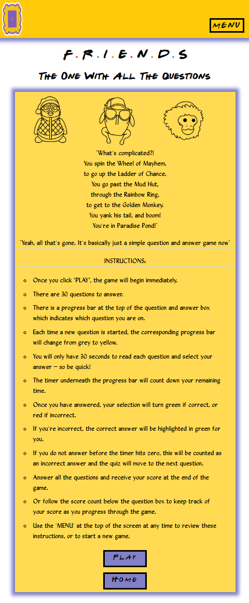</h2> Help Page (Mobile)
<h2>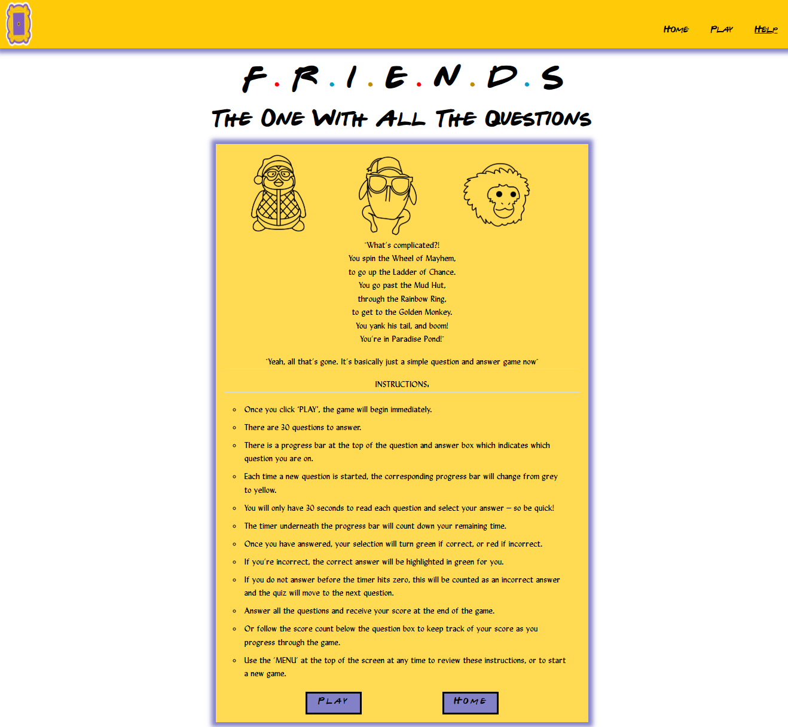</h2>Help Page (Desktop)

### 404 Error Page
* A custom 404 error page displays if the user tries to access an incorrect URL within the site.  
* This is a simple page which features 3 Friends related images and Friends related references, as well as a button which directs the user back to the homepage. 
* I followed [this guidance](https://docs.github.com/en/pages/getting-started-with-github-pages/creating-a-custom-404-page-for-your-github-pages-siteS) from Github to create the page.  
<h2>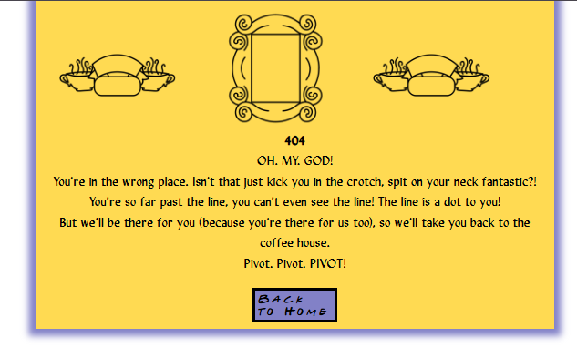</h2>404 Error Page

## Future Additions
I decided that the following features were ‘could-haves’ - they would be nice to have but were not essential for a ‘minimum viable product’.   
* Displaying a message along with the user’s final score which differs depending on the score they achieve. 
* A time limit imposed on each question. 
* Questions and possible answers appearing in a different random order each time a new game is played. 
* Ability to filter questions by difficulty level. 

Due to time constraints, I have not been able to implement the ability to filter the questions by difficulty level. I have been able implement all other ‘could have’ features. Given that the quiz does contain questions of varying difficultly, I decided that whilst it would be nice for the user to be able to filter those questions according, this did not add as much value to the game as the other ‘could have’ features. Therefore, I chose to prioritise those.  

Some additional features that I would like to implement in the future are: 

* To increase replay-ability of the quiz, I would like to increase the pool of available questions and display only a proportion of these during each game. This would mean that the user could play the game many times over and be asked questions they have not seen before, on each playthrough. 
* To supplement the quiz and add more value for the user, I would like implement a quote generator. This would have options to select a Friends character and view a selection of randomised quotes from them, as well as options to select an episode and receive randomised quotes from that episode.  
* I would also like to add an episode selector feature. The user would be able to select a category (such as birthdays, weddings, Christmas etc) and receive a list of episodes which meet this criteria. The user would also be able to select a mood from a pre-defined list (e.g. I want to cry, I want to feel motivated etc) and receive a list of recommended episodes based on that mood. 
* I have also written all the content for a 6-question ‘which character are you most like' quiz that I would like to add to the site at a later stage.  

# Wireframes
REMEMBER TO ADD WIREFRAMES !!!!
********
*********
*****

 # Design

 ## Colour Scheme
 * The colours used in the site were taken from the colours of the back of Monica Geller's front door.
 * The colour scheme was designed using [Coolors](https://coolors.co/). I used their [Color Picker tool](https://coolors.co/ffc73f) on an image of the door to pick out the colours of the door itself (tropical indigo - purple), the peephole frame (jonquil - yellow) and the doorknob (metallic gold).
 * All colour combinations were tested for accessibility using [WebAim: Contrast Checker](https://webaim.org/resources/contrastchecker/). 
 * Except for the Homepage which features a full-page background image, the other pages on the site feature coloured boxes placed on a white background. These boxes are either purple or yellow and use the opposite colour for any buttons. The gold colour is used as a border colour around any purple boxes and around the name tag image on the introduction modal. 
 * Jonquil yellow is used as the background colour on both the nav bar and the footer. 
 * An alpha value is applied to jonquil yellow when used as a box colour on the Help and 404 Error pages to distinguish it from the nav bar and footer. 
 * The buttons on the site which sit against a purple background are yellow and buttons which sit against a yellow background are purple to ensure they stand out from the rest of the content. 
 * All buttons regardless of their starting colour, change to white when clicked to maintain readability and accessibility. 
 * Black is used as the font colour, except for the correct and incorrect scores underneath the question and answers box, which are green and red respectively. 
 * The black font is contrasted with blue as the hover colour, to ensure readability and accessibility. 
 <h2></h2>Background colour palette
 <h2>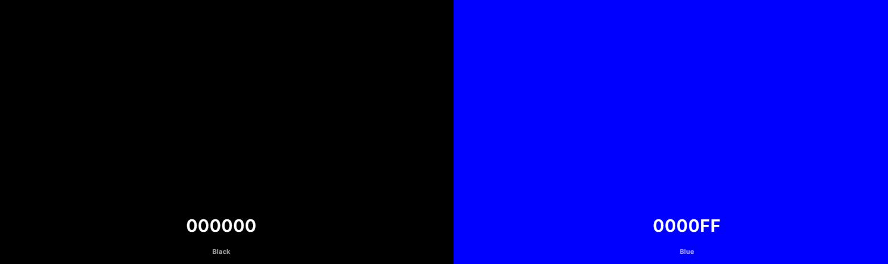</h2>Font colour palette
 <h2>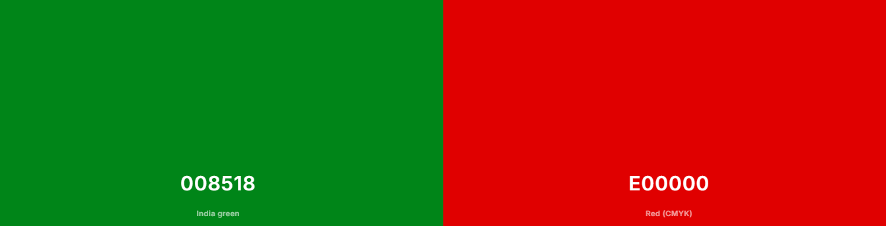</h2>Correct and incorrect score tally colours

### Site Title Colour Scheme
 * The title of the site is 'Friends', with the subtitle of 'The One with all the Questions'.
 * The coloured dots which appear between each letter in the word 'Friends' in the opening credits of the show, are an integral part of the Friends brand. They appear on official merchandise, on DVD covers and on Netflix thumbnails. The colours of the dots match the colours of umbrellas held by the 6 main cast members in the opening credits. Therefore it was crucial to include the dots in the title of the website as avid Friends fans will expect to see them.
 * The colours used for the dots were generated by [Coolors](https://coolors.co/). I used their [Color Picker tool](https://coolors.co/ffc73f) on a screenshot of the opening credits of an episode of Friends to pick out colours which match those of the original dots as closely as possible (red, blue and yellow).
 * In order to maintain accessibility, the colours used for the blue and yellow dots are slightly darker on the play page (where they are against a white background), as using the same colours as used on the homepage, resulted in a contrast error when the page was tested using the [WAVE Web Accessibility Evaulation Tool](https://wave.webaim.org/) and the [WebAim Contrast Checker](https://webaim.org/resources/contrastchecker/) - [see Testing file](TESTING.md) for details. The colour of the red dot presented no contrast errors on a white background, and is therefore left unchanged.
    

          
Dot Colours used for Homepage
 
          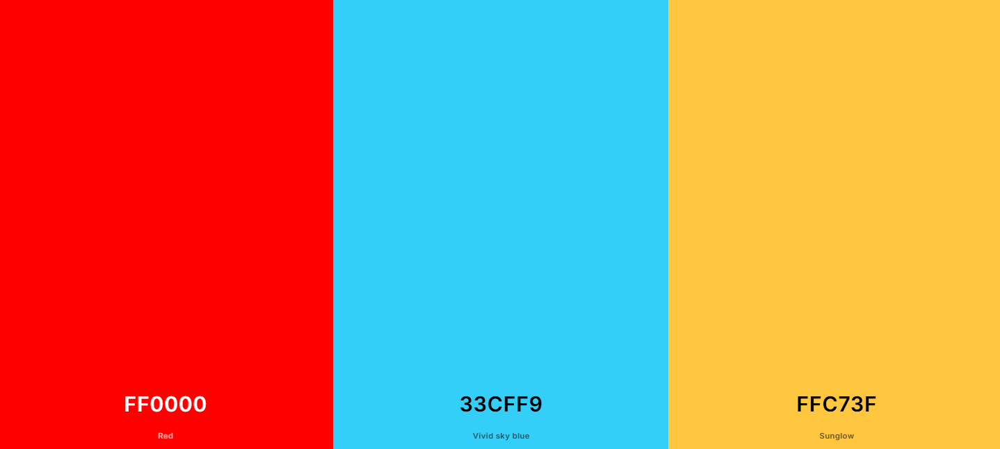 
     

     

          
Coloured dots in the site title on Homepage (desktop)

          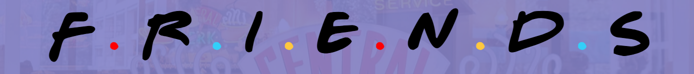 
     

     

          
Blue and Yellow Dot Colours used for Play page
 
           
     

      

          
Coloured dots in the site title on Play page (desktop)

          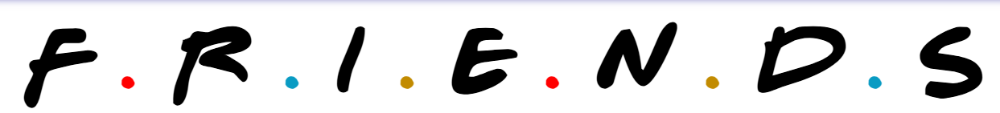 
     

 ## Typography
  * The Font used in the opening credits of 'Friends' is very distinctive and easily recognisable - especially to avid fans of the show. Therefore I knew I needed to use a font as close as possible to the original to make the site appealling to Friends fans. I used [Google](https://www.google.co.uk/) to research which font was the closest match. The results showed that this was Gabriel Weiss' Friends Font. I downloaded this font from [Font Meme](https://fontmeme.com/fonts/gabriel-weiss-friends-font-font/).
     

          
Google search results for Friends TV show font

           
     

     

          
Gabriel Weiss' Friends Font

           
     

* The Gabriel Weiss’ Friends Font is entirely upper case by default. To keep the font authentic, I have not adjusted this. I did, however, notice that the font in its default state, placed the letters quite close to each other, which made it slightly difficult to read. For user convenience and accessibility, I have used CSS to add a small amount of letter spacing to rectify this. 
* The font [Crashbow](https://fontmeme.com/fonts/crashbow-font/) - also from Font Meme, is the first fallback font, in case Gabriel Weiss' Friends Font fails to load correctly. It was selected due to its similarity to Gabriel Weiss' Friends Font.
     

          
Crashbow font

           
     

* Two further fallback fonts have been set, in case neither Gabriel Weiss' Friends Font or Crashbow load correctly. The second fallback is Cursive, with Serif as the third and final fallback font.
* I noticed that the Gabriel Weiss Friends Font becomes quite difficult to read when applied to large chunks of text.  
* Friends uses a secondary font for its end credits. I conducted a Google search which identified that font as [Lydian](https://fontmeme.com/fonts/lydian-font/). 
* As the Lydian font is easier to read, it has been used on areas of the site which contain a lot of text i.e. the introduction modal, the question and answers box on the Play Page, the final score boxes, the Help Page and the 404 Error Page. 
     

          
Google search results for Friends end credits font

          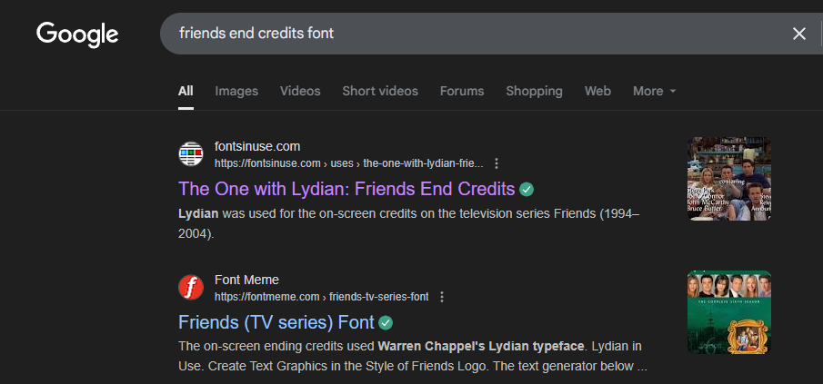 
     

     

          
Lydian font

          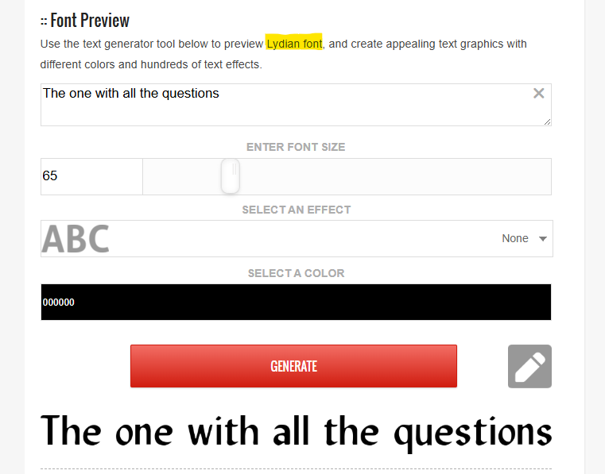 
     

## Imagery
All images used in the site are related to Friends.

   
### Aspect Ratios
Aspect ratios chosen for use in the site were:  
* 16:9 (hero image)
* 3:2 (logo)
* 5:4 (other images) 

16:9 - this aspect ratio was chosen for hero images as these images are designed to span the whole width of the page on all screen sizes and therefore, need to be wide. 16:9 is a very versatile aspect ratio used by lots of modern media formats and provides an immersive viewing experience.

3:2 - this aspect ratio was chosen as it suits images which are in landscape orientation in their original state, because it makes the images wider than they are tall. 3:2 suits such images especially well as the result is images that are:  
* visually pleasing;
* wide enough to draw sufficient attention to the focal point without being too wide (such as 16:9 would be);
* not too square (such as 1:1 would be). 

5:4 – this aspect ratio was chosen as it gives a good balance between height and width, which makes it a good match for images intended to be viewed on a screen. 

###  Image animation
All images used on the site (except the hero image) subtly rotate in some way when hovered over, to add visual interest and interactivity. 

## Logo
* [Printerval](https://printerval.com/peephole-frame-friends-sticker-sticker756055-peephole-frame-p797344) - was used to source the image of the peephole frame from the back of Monica's front door. The image was found via a [Google](https://www.google.co.uk/) image search with results set to 'Creative Commons licenses'. This image was then used as the site's logo.
     

          
Google image search for 'friends door peephole' with results set to 'Creative Commons licenses'

          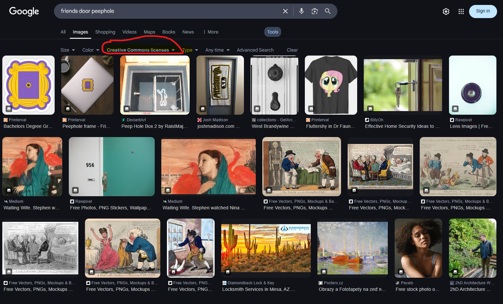 
     

     

          
Explanation of Creative Commons licenses

           
     

* The logo is animated and rotates 180 degrees when the user hovers over it.
* For convenience, clicking the logo on the navbar will always take the user back to the Homepage.

## Favicons
* The favicon was generated using [Favicon.io](https://favicon.io/). 
* The favicon is the peephole frame logo.

# Technologies Used
## Languages
* [HTML5](https://en.wikipedia.org/wiki/HTML5)
* [CSS3](https://en.wikipedia.org/wiki/CSS)
* [JavaScript](https://en.wikipedia.org/wiki/JavaScript)

## Frameworks Libraries and Programmes
 ### Creation
  * [Visual Studio Code](https://code.visualstudio.com/) – was the code editor used.
  * [Git](https://git-scm.com/) – was used for version control.
  * [GitHub](https://github.com/) – was used to create and store the project repository and create and track the user stories project board.
  * [Bootstrap breakpoints](https://getbootstrap.com/docs/5.0/layout/breakpoints/) - the breakpoints defined by Bootstrap were used to make this project responsive.
  * [Font Meme](https://fontmeme.com/) – was used to choose and import the fonts used in the site. The specific fonts used are: 
     * [Gabriel Weiss' Friends Font](https://fontmeme.com/fonts/gabriel-weiss-friends-font-font/) - as the main font.
     * [Crashbow](https://fontmeme.com/fonts/crashbow-font/) - as a back-up font, due to its similarity to Gabriel Weiss' Friends Font.
     * [Lydian](https://fontmeme.com/fonts/lydian-font/) - as the secondary font, used for areas of the site which contain a lot of text.
  * [Canva](https://www.canva.com/) – was used to create the wireframes, remove the background from images, and crop all images to the desired aspect ratio.
  * [Google Chrome Developer Tools](https://developer.chrome.com/docs/devtools/) – was used while building the project to test responsiveness, and for debugging.

  ### Testing
  * [W3C HTML Validator](https://validator.w3.org/) – was used to validate the HTML.
  * [W3C CSS Validator](https://jigsaw.w3.org/css-validator/) – was used to validate the CSS.
  * [JS Hint](https://jshint.com/) - was used to validate the JavaScript.
  * [WAVE Web Accessibility Evaluation Tools](https://wave.webaim.org/) – was used to test the site for accessibility.
  * [Google Chrome Developer Tools (Lighthouse feature)](https://developer.chrome.com/docs/lighthouse/overview) - was used to test the site for Performance, Accessibility, Best Practices and SEO.

  ### Images
  * [Pexels](https://www.pexels.com/) - was used to source the [Central Perk background image](https://www.pexels.com/photo/festive-central-perk-cafe-window-display-30500272/) used in the homepage of the site.
  * [Printerval](https://printerval.com/us) was used to source:-
    * the image of the [peephole frame](https://printerval.com/peephole-frame-friends-sticker-sticker756055-peephole-frame-p797344) from the back of Monica Gellar's front door which was used as the site's logo.
    * the image of the [Princess Consuela name tag](https://printerval.com/friends-hello-my-name-is-princess-consuela-banana-hammock-friends-phone-case-phone-case7364869-friends-hello-my-name-is-princess-consuela-banana-p756448?__cf_chl_tk=Ma0.9LKPzAZUXU9W6IA4YQw14XXY3K4cd7w57Q2TT4k-1746235802-1.0.1.1-M...) which was used as the image on the introduction modal. 
    * Both images were found via a Google image search with results set to 'Creative Commons licenses'.
     

          
Friends peephole frame Google Search

           
     

      

          
Princess Consuela Google Search

          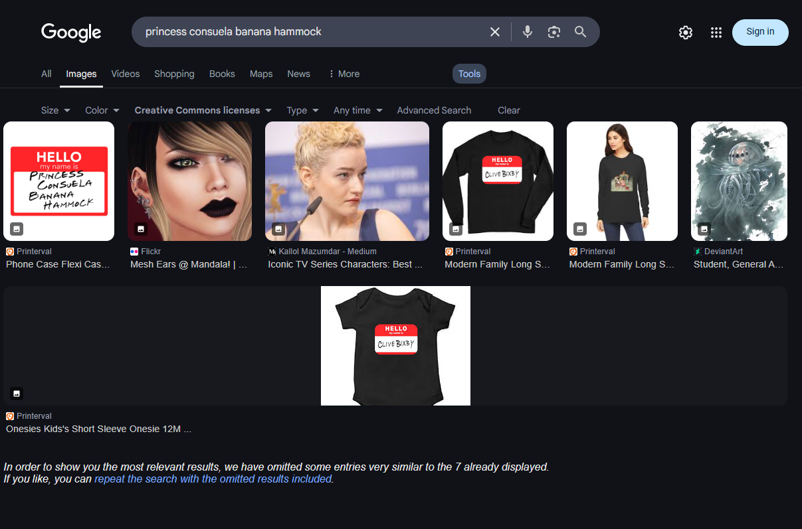 
     

  * [Noun Project](https://thenounproject.com/) - was used to source the ['Friends Icons Set' by created by Amelia Detwiler](https://thenounproject.com/browse/collection-icon/friends-30104/). All icons from the collection were used in the site.
  * [Tinify](https://tinypng.com/) – was used to optimise all images.
  * [Canva](https://www.canva.com/) – was used to remove the background from images, and to crop all images to the desired aspect ratio.
  * [Favicon.io](https://favicon.io/) – was used to generate the site’s favicon.
  * [Techsini](https://techsini.com/multi-mockup/) – was used to generate a mockup of the homepage on various screen sizes.
  * [Coolors](https://coolors.co/) – was used to generate the site’s colour scheme.
  * [WebAIM Contrast Checker](https://webaim.org/resources/contrastchecker/) – was used to test all colour combinations for accessibility.

 ### Miscellaneous 
 * [ChatGPT](https://openai.com/index/chatgpt/) – was used for proof-reading and to help with general trouble-shooting. 
 * [Microsoft Word](https://www.microsoft.com/en-gb/microsoft-365/word) - was used for proof-reading.
 * [Google](https://www.google.co.uk/) - was the search engine used to conduct all online research.

# Testing and Validation
Please refer to [this file](TESTING.md) for details of the testing and validation undertaken.

# Deployment
## GitHub Pages
This site was deployed to GitHub pages. The steps to deploy a site are as follows:

* Log in to GitHub and navigate to the required repository.
* Navigate to the ‘Settings’ tab on the navbar at the top of the page.
* Navigate to ‘Pages’ on the menu on the left-hand side of the page.
* Navigate to ‘Build and deployment’ and select ‘Deploy from a branch’ from the dropdown menu under source.
* Select ‘main’ and ‘root’ under branch and click save.
* The page will automatically refresh and a link to the deployed site will appear under ‘Deployments’ on the right-hand side of the page.
* If for any reason, the page does not automatically refresh. Navigate to the top of the page and click on the repository name (next to your GitHub profile name) to go back to the homepage for the repository.
* From here you will now see ‘Deployments’ on the right-hand side of the page.
* Click the link below 'Deployments' to access your deployed site.

## Forking the GitHub Repository
* Log in to GitHub and navigate to the required repository.
* Navigate to the right-hand side of the page and click ‘Fork’. This is located in-line with your repository name underneath the nav bar. 
* Give the forked repository a name of your choosing.
* Amend the repository description if required.
* Tick ‘Copy the main branch only'.
*	Click the ‘Create fork’ button.
* You will now have a copy of the original repository in your GitHub account.

## Making a Local Clone
* Log in to GitHub and navigate to the required repository.
* Click on the ‘Code’ button at the top of the repository and copy the URL. 
* Open Git Bash in your IDE of choice and change the working directory to the location where you want the cloned directory.
* Type git clone, then paste the URL you copied earlier.
* Press enter. Your local clone will be created.

# Credits
## Content
* All copy, questions and answers on the site were written by me. I referred to the relevant episodes of Friends to verify all answers and information given to ensure everything is correct.
* [Warner Bros](https://www.warnerbros.co.uk/tv/friends) - for the site colour scheme and the Friends quotes and references which appear throughout the site.
* The following GitHub repositories for inspiration for creatind a themed quiz using closable modals :-
     * [Diane-4P 'Harry Potter quiz'](https://github.com/Diane-4P/harry-potter-quiz?tab=readme-ov-file)  
     * [suzybee1987 'Terry pratchett Discworld quiz'](https://github.com/suzybee1987/milestone-2) 
* the structure and content of the README.md and TESTING.md was based on both my own [milestone-project-one](https://github.com/lucyinthesky2111/milestone-project-one) repository and [Isabella Mitchell's 'Fledgling Bird Game'](https://github.com/Isabella-Mitchell/fledgling-bird-game) repository.
 
## Code
* [Code Institute Love Maths walkthrough project](https://github.com/Code-Institute-Solutions/love-maths-2.0-sourcecode) :-
  - for help with structuring the HTML for this project.
  - for help incrementing the correct and incorrect scores.
* [Code Institute Love Running walkthrough project](https://github.com/Code-Institute-Solutions/love-running-v3) :-
  - for the code for the social media links in the footer. 
  - for the code for the general styles used to push the footer to the bottom of the page. 
  - for help with the code for the responsive nav bar.
* [Treehouse - 'Beginner JavaScript project: build a quiz app' YouTube video](https://www.youtube.com/watch?v=_FnFPmA87XU&t=1000s) - the JS code for the handleQuestion function and the accompanying CSS was adapted from this video.
* The following sites were used to research CSS properties and JS methods used in the site :-
     * [FreeCodeCamp](https://www.freecodecamp.org/)
     * [W3Schools](https://www.w3schools.com/)
     * [Stack Overflow](https://stackoverflow.com/questions)
     * [Dev.to](https://dev.to/)
     * [Sitepoint](https://www.sitepoint.com/simple-javascript-quiz/#demo) 

## Acknowledgments
I would like to thank the following people for their support and feedback in the creation of this project: 
* My course tutor Ashley Oliver  
* My friend James Newell  
* My mentor Mitko Bachvarov 
* Matthew-5P on Slack for peer reviewing my project and providing very helpful feedback. 
* All friends and family members who kindly tested the site for me 

# Developer Comments

# Disclaimer

This project is for educational purposes only and not for public use. It was created for the Code Institute assessed project for the 'Interactive Front End' module.  

This project is not affiliated with ‘Friends’ the TV show. 

All trademarked and/or copyrighted content are the property of their respective owners.  
 
Created by Lucy Kidner, 2025. 
