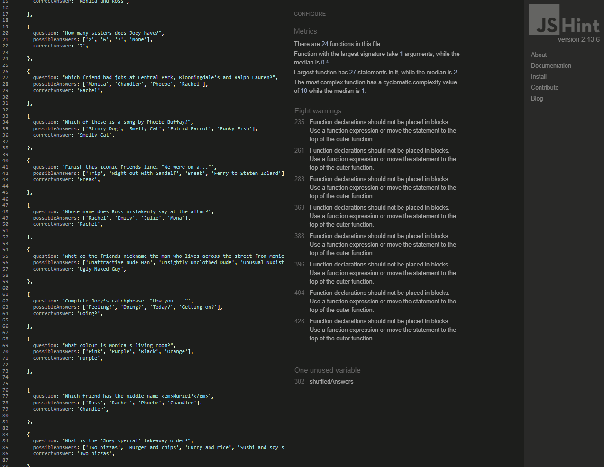

# Testing

The one with all the questions - 'Friends' interactive trivia website has been tested using the following methods:
- [Code Validation](#code-validation)
    - [W3C HTML Validator](#w3c-html-validator) 
        - [Homepage](#homepage)
        - [Play Page](#play-page)
        - [help Page](#help-page)
        - [404 Error Page](#404-error-page)
    - [W3C CSS Validator](#w3c-css-validator)
    - [JSHint JavaScript Validator](#jshint-javascript-validator)
- [Lighthouse](#lighthouse)
- [Responsiveness](#responsiveness)
- [WAVE Web Accessibility Evaluation Tools Checker](#wave-web-accessibility-evaluation-tools-checker)
- [Browser Compatibility](#browser-compatibility)
- [Testing User Expectations and Requirements](#testing-user-expectations-and-requirements)
- [Testing User Stories](#testing-user-stories)
- [Peer Review](#peer-review)
- [Bugs](#bugs)
    - [Resolved](#resolved)
    - [Unresolved](#unresolved)

# Code Validation
## W3C HTML Validator
The one with all the questions - 'Friends' interactive trivia website returned no errors or warnings when tested using the W3C HTML Validator tool.

There was originally a contrast error on the Play Page caused by the blue and yellow coloured dots in the site title, which was subsequently resolved (see [Resolved Bugs](#resolved)).

### Homepage 
<h2 align="center"></h2>

### Play Page
<h2 align="center"></h2>

### Help Page
<h2 align="center"></h2>

### 404 Error Page
<h2 align="center"></h2>

## W3C CSS Validator
The one with all the questions - 'Friends' interactive trivia website returned no errors or warnings when tested using the W3C CSS Validator tool.
### CSS Stylesheet
<h2 align="center"></h2>

## JSHint JavaScript Validator
The one with all the questions - 'Friends' interactive trivia website returned no errors when tested using the JSHint JavaScript Validator tool, but did return a several instances of the same warning (see [Unresolved Bugs](#unresolved))
### JS Script File
<h2 align="center"></h2>

# Lighthouse
* I ran Lighthouse reports in Google Devtools to test for :- Performance, Accessibility, Best Practices and SEO.
* All pages performed well on desktop (with most performing very well) :

## Homepage (Desktop)
<h2 align="center"></h2>

## Play Page (Desktop)
<h2 align="center"></h2>

## Help Page (Desktop)
<h2 align="center"></h2>

## 404 Error Page (Desktop) 
<h2 align="center"></h2>

* While results were also generally good on mobile, Lighthouse did make some suggestions as to how to improve (see [Unresolved Bugs](#unresolved)).
## Homepage (Mobile)
<h2 align="center"></h2>

## Play Page (Mobile)
<h2 align="center"></h2>

## Help Page (Mobile)
<h2 align="center"></h2>

## 404 Error Page (Mobile)
<h2 align="center"></h2>

# Responsiveness
 CSS media queries were used to make this website responsive. When writing media queries, I used the same breakpoints as Bootstrap. Details of these breakpoints can be found [here](https://getbootstrap.com/docs/5.0/layout/breakpoints/). Responsivity at the Bootstrap breakpoints, and on different device screen sizes, was tested using Google Chrome Devtools. Device screen sizes tested include:
* iPhone SE
* iPhone XR
* iPhone 12 Pro
* iPhone 14 Pro Max
* Pixel 7
* Samsung Galaxy S8+
* Samsung Galaxy S20 Ultra
* iPad Mini
* iPad Air
* iPad Pro
* Surface Pro 7
* Surface Duo
* Galaxy Z Fold 5
* Asus Zenbook Fold
* Samsung Galaxy A51/71
* Nest Hub
* Nest Hub Max
* Galaxy Fold

* I personally tested the website on a Samsung Galaxy S22, a 9th generation iPad, an Asus Tuf Gaming A15 laptop and a Samsung Odyssey G5 34" curved monitor.

# WAVE Web Accessibility Evaluation Tools Checker
The one with all the questions - 'Friends' interactive trivia website returned no errors or contrast errors when tested using the WAVE Web Accessibility Evaluation Tools Checker. 
## Homepage 
<h2 align="center"></h2>

## Play Page 
<h2 align="center"></h2>

## Help Page 
<h2 align="center"></h2>

## 404 Error Page  
<h2 align="center"></h2>

# Browser Compatibility
* The site was tested and performed as expected on Google Chrome, Mozilla Firefox and Microsoft Edge.
* The site was also tested on Safari, on which there was one small issue which has not been rectified as yet (see [Unresolved Bugs](#unresolved)).
* The site was also tested on Samsung Internet, on which there were some issues. One of which has subsequently been rectified (see [Resolved Bugs](#resolved)) and one of which has not (see [Unresolved Bugs](#unresolved)).

# Testing User Expectations and Requirements
All user expectations and requirements (user story 1: user friendly navigation and responsive design) have been satisfied.
* The site is fully responsive on screen sizes from 320px and upwards. 
* The site is fully accessible, it contains appropriate alt text, a colour scheme of sufficient contrast, and has passed WAVE accessibility testing. 
* All images used in the site have been optimised and cropped to suitable aspect ratios. 
* There is a responsive nav bar and footer on all pages. 
* All navigation links have been tested and proven to work. 
* All navigation buttons have been tested and proven to work.  
* All social links in the footer have been tested, proven to work and proven to open in a new tab. 
* All copy on the site has been proof-read and proven to be clear, concise and free of SPAG (spelling, grammar and punctuation errors). 
* There is an Introduction Modal on the Homepage which clearly explains the purpose of the site to the user (without the need for them to look at the corresponding site documentation) and links to other pages of the site. 

# Testing User Stories
### Testing remaining user stories:

### Must Have
User story 2: clear instructions as to how to play the game which are accessible from anywhere on the site. 
* There is a dedicated Help Page which the user can access from anywhere on the site, either via buttons on the page or links in the nav bar. 
* The Help Page contains clear and concise step-by-step instructions as to how to play the game. 
* The Help Page itself also explains to the user how they can revisit this page during game play if they need a reminder of the rules (by visiting the menu in the nav bar and clicking the ‘help’ link). 

User story 3:  immediate visual feedback as to whether my answer is correct or incorrect for each question. 
* Possible answer buttons for each question have been tested and proven to highlight in green when the user selects the correct answer. 
* The buttons have also been proven to highlight in red when the user selects an incorrect answer. 
* It has also been proven that when an incorrect answer is selected, the correct answer is highlighted in green for the user’s information. 
* There is an appropriate delay of 1 second between the answer feedback and the quiz moving on to the next question, to allow the user time to see their result. 

User story 4: facility to see my final score at the end of the game, so I can replay and try to beat it. 
* The user’s final score has been proven to always display at the end of the game, regardless of what score the user achieves. 
* It has also been proven that when the final score is displayed, any content which is no longer needed on the page (e.g. timer, progress bar, questions and answers box), are all hidden as expected.  
* The navigation buttons which appear at the end of the game, directing the user to either play again or return home, have been tested and proven to work. 

User story 5: for there to be questions of varying difficulty levels, so I can participate regardless of my knowledge level. 
* The quiz features a pool of 30 questions. 
* 10 of those questions are categorised as ‘easy, 10 as ‘medium’ and 10 as ‘hard’ to ensure each category has an equal number of questions. 
* The questions have been written and categorised by myself using my extensive knowledge of the show as a frame of reference.  

 ### Should Have
 User story 6: visual indication of my progress, showing my current stage of the game. 
 * There is a visual progress bar at the top of the quiz container which effectively tracks the user’s progress through the game. 
 * There is a bar representing each question in the quiz. 
 * All bars are visible and coloured grey at the outset of the game. 
 * As expected, each bar turns yellow, one at a time, as each question is displayed. 
  
User story 7: facility to see my current score throughout the game. 
* There is a running score count displayed underneath the question and answers box when the user is playing the game. 
* Both the correct and incorrect score are tallied correctly (incrementing each category by one mark as appropriate) and at the correct time (as soon as the user has answered and their answered has been ‘marked’). 

 ### Could Have
 User story 8: a Friends related message along with my final score, which is different according to what score I achieve. 
 * Testing of the game achieving different scores each time, has verified that a different Friends related message is displayed according to the user’s final score as expected. 
 * It has been proven that there are 5 different messages available, 1 for each of these score brackets: 0-7, 8-15, 16-23, 24-29, 30 and that the correct message appears for the relevant score bracket. 

 User story 9: a time limit on each question, to add a small amount of pressure, and make the game more challenging and exciting. 
 * A timer appears for each question. 
 * The timer counts down the user’s remaining time from 30 seconds to 0, in 1 second decrements as expected. 
 * If the timer hits 0 before the user answers, the relevant ‘Time’s up!’ message has been proven to appear as required. 
 * It has been proven that after the ‘Time’s up!’ message has been shown, the quiz auto-advances to the next question as planned so that the user does not get a second chance to answer. 
 * It has been verified that the user is not shown the correct answer if they do not make an attempt to answer the question before the timer runs out as expected. 
 * It has been proven that if the user does not answer before the timer hits zero, this is counted as an incorrect answer and the user’s incorrect answer tally is incremented by one mark. 
 * The timer correctly resets back to 30 seconds remaining each time a new question is started. 

User story 10: the questions and possible answers appear in a random order each time I play to increase replay-ability. 
 * Multiple test plays of the game have proven that the questions and possible answers do in fact, appear in a different random order in each new game as expected. 

User story 11: ability to filter questions by difficulty level. 
* Due to time constraints, this feature has not yet been implemented but will be added in the future.

# Peer Review
* In the final stages of the project development, I submitted the project for review by fellow Code Institute students and alumni on slack. 
* I received feedback that the quiz was functioning well with no errors found.  
* It was suggested that to improve the user experience, I could add functionality for the user to exit or restart the game whilst it is in progress. Whilst these would be useful features, I decided not to implement them as I felt it was too late in the project, due to the proximity of the submission deadline. However, this is something I will remember for future projects. 

* The site was proof-read by me. In addition to this, I also used ChatGPT and the ‘read aloud’ feature of Microsoft Word for further proof-reading. Any minor typographical or grammatical errors found were subsequently corrected. 

* I asked a number of friends and family members to test the site for typos, to check the quiz works correctly, and that the external links to social media sites in the footer all open in new tabs. No errors were reported. Feedback from a particularly avid Friends fan was that they especially liked all the details that had been added to keep the whole site in keeping with the Friends theme.
       
# Bugs 
## Resolved

* There was originally a contrast error on the Play Page caused by the blue and yellow coloured dots in the site title, which was subsequently resolved. The issue was that the original blue and yellow colours are too light against a white background. To solve this issue, slightly darker variants of these colours were used on the Play Page instead. The Play Page subsequently passed Wave Accessibility testing with no issues.

* On first run of the W3C HTML Validator, the error shown below was flagged on all pages of the site. This was resolved by replacing the p element with a span element. All pages of the site subsequently passed validation. 
        

          
HTML error (now resolved)

           
         

* When playing the game on my personal mobile device (Samsung Galaxy S22), there was an issue with the timer box distorting at 27 seconds remaining, whereby the text displayed on two lines rather than one. This issue was resolved by increasing the width of the timer box. 

## Unresolved

* JS Hint returns warnings that function declarations should not be placed in blocks. Use a function expression or move the statement to the top of the outer function. Whilst I appreciate that my current JS code may be not be optimal, it functions well enough for a MVP and therefore, due to time constraints, the warnings have not been rectified at this stage. 

* Lighthouse recommends rectifying the largest contentful paint and serving images in next-gen formats to improve mobile performance on lower scoring pages. This recommendation was not acted upon at this time as current performance is still acceptable, especially for an MVP, but this could be looked into in the future, especially if the site expands with additional content.

* When testing the game on Sarfari on my 9th generation iPad and on Samsung Internet on my Samsung Galaxy S22, I noticed that the text in the answer boxes appears to the left of the box rather than in the centre. This happens despite the text being set to align centrally with CSS. The text displays correctly when viewing the site on other devices and browsers. Therefore, this appears to be isolated to these particular devices and/or browsers. As this is only a minor aesthetic issue which does not affect game play, it has been left unresolved at this stage due to time constraints. 
        

          
Text alignment error on Sarfari and Samsung Internet

           
         

* I received some feedback in my last project that HTML files should be organized into a folder. I tried to implement this for this project however, having HTML files in folders works on the live server but not in the deployed site. Due to the small number of HTML files (4) in this project, I decided not to fix this, as in this instance, the lack of folders only creates a minor annoyance rather than a major problem. I would have spent the time to rectify this issue had there been a vast number of HTML files.

Back to [README.md](./README.md)