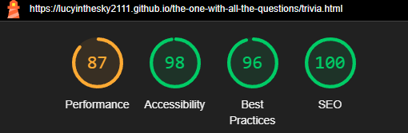
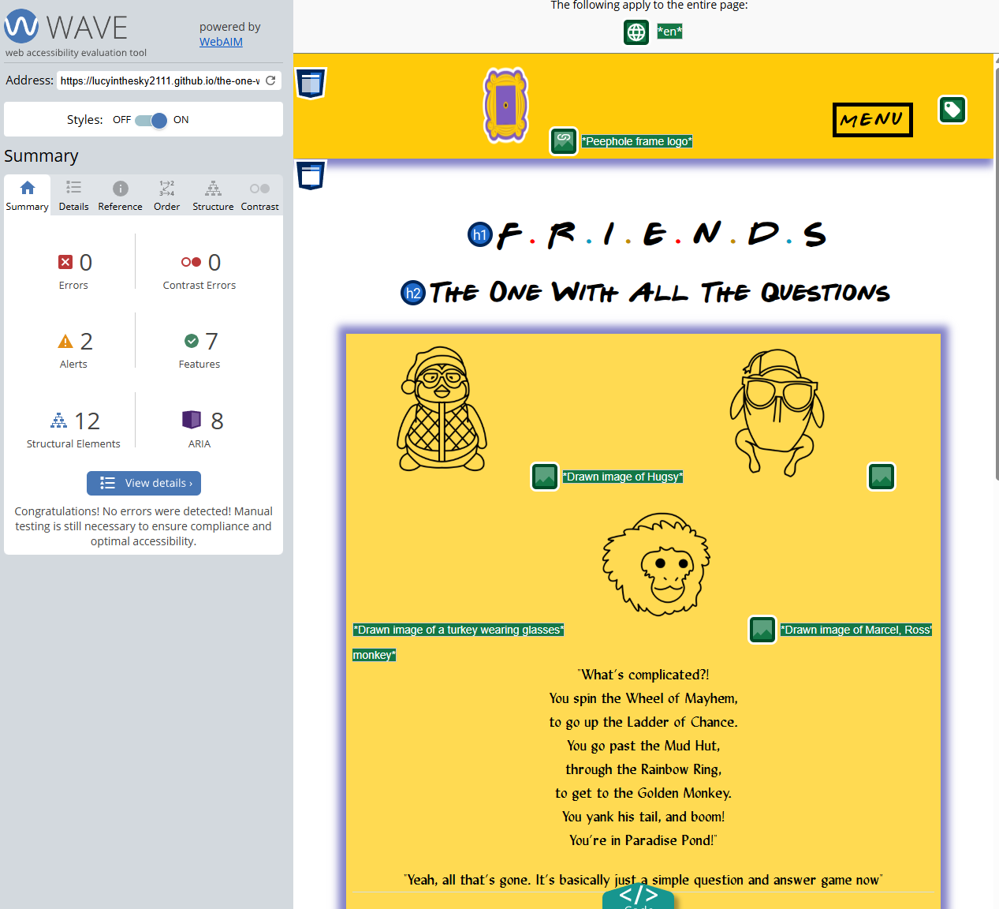

# Testing

The The one with all the questions - 'Friends' interactive trivia website has been tested using the following methods:
- [Code Validation](#code-validation)
    - [W3C HTML Validator](#w3c-html-validator) 
        - [Homepage](#homepage)
        - [Play Page](#play-page)
        - [help Page](#help-page)
        - [404 Error Page](#404-error-page)
    - [W3C CSS Validator](#w3c-css-validator)
    - [JSHint JavaScript Validator](#jshint-javascript-validator)
- [Lighthouse](#lighthouse)
- [Responsiveness](#responsiveness)
- [WAVE Web Accessibility Evaluation Tools Checker](#wave-web-accessibility-evaluation-tools-checker)
- [Browser Compatibility](#browser-compatibility)
- [Testing User Expectations and Requirements](#testing-user-expectations-and-requirements)
- [Testing User Stories](#testing-user-stories)
- [Peer Review](#peer-review)
- [Bugs](#bugs)
    - [Resolved](#resolved)
    - [Unresolved](#unresolved)

# Code Validation
## W3C HTML Validator
The one with all the questions - 'Friends' interactive trivia website returned no errors or warnings when tested using the W3C HTML Validator tool.

There was orginally a contrast error on the Play Page caused by the blue and yellow coloured dots in the site title, which was subsequently resolved (see [Resolved Bugs](#resolved)).

### Homepage 
<h2 align="center"></h2>

### Play Page
<h2 align="center"></h2>

### Help Page
<h2 align="center"></h2>

### 404 Error Page
<h2 align="center"></h2>

## W3C CSS Validator
The The one with all the questions - 'Friends' interactive trivia website returned no errors or warnings when tested using the W3C CSS Validator tool.
### CSS Stylesheet
<h2 align="center"></h2>

## JSHint JavaScript Validator
The The one with all the questions - 'Friends' interactive trivia website returned no errors or warnings when tested using the JSHint JavaScript Validator tool.
### JS Script File
<h2 align="center"></h2>

# Lighthouse
* I ran Lighthouse reports in Google Devtools to test for :- Performance, Accessibility, Best Practices and SEO.
* All pages performed well on desktop (with most performing very well) :

## Homepage (Desktop)
<h2 align="center"></h2>

## Play Page (Desktop)
<h2 align="center"></h2>

## Help Page (Desktop)
<h2 align="center"></h2>

## 404 Error Page (Desktop) 
<h2 align="center"></h2>

* While results were also generally good on mobile, Lighthouse did make some suggestions as to how to improve (see [Unresolved Bugs](#unresolved)).
## Homepage (Mobile)
<h2 align="center"></h2>

## Play Page (Mobile)
<h2 align="center"></h2>

## Help Page (Mobile)
<h2 align="center"></h2>

## 404 Error Page (Mobile)
<h2 align="center"></h2>

# Responsiveness
 CSS media queries were used to make this website responsive. When writing media queries, I used the same breakpoints as Bootstrap. Details of these breakpoints can be found [here](https://getbootstrap.com/docs/5.0/layout/breakpoints/). Responsivity at the Bootstrap breakpoints, and on different device screen sizes, was tested using Google Chrome Devtools. Device screen sizes tested include:
* iPhone SE
* iPhone XR
* iPhone 12 Pro
* iPhone 14 Pro Max
* Pixel 7
* Samsung Galaxy S8+
* Samsung Galaxy S20 Ultra
* iPad Mini
* iPad Air
* iPad Pro
* Surface Pro 7
* Surface Duo
* Galaxy Z Fold 5
* Asus Zenbook Fold
* Samsung Galaxy A51/71
* Nest Hub
* Nest Hub Max
* Galaxy Fold

* I personally tested the website on a Samsung Galaxy S22, a 9th generation iPad, an Asus Tuf Gaming A15 laptop and a Samsung Odyssey G5 34" curved monitor.

# WAVE Web Accessibility Evaluation Tools Checker
The one with all the questions - 'Friends' interactive trivia website returned no errors or contrast errors when tested using the WAVE Web Accessibility Evaluation Tools Checker. 
## Homepage 
<h2 align="center"></h2>

## Play Page 
<h2 align="center"></h2>

## Help Page 
<h2 align="center"></h2>

## 404 Error Page  
<h2 align="center"></h2>

# Browser Compatibility
* The site was tested and performed as expected on Google Chrome, Mozilla Firefox and Microsoft Edge.
* The site was also tested on Safari, on which there was one small issue which has not been rectified as yet (see [Unresolved Bugs](#unresolved)).
* The site was also tested on Samsung Internet, on which there were some issues. One of which has subsequently been rectified (see [Resolved Bugs](#resolved)) and one of which has not (see [Unresolved Bugs](#unresolved)).

# Testing User Expectations and Requirements
All user expectations and requirements (user story 1: user friendly navigation and responsive design) have been satisfied.
* The site is fully responsive on screen sizes from 320px and upwards. 
* The site is fully accessible, it contains appropriate alt text, a colour scheme of sufficient contrast, and has passed WAVE accessibility testing. 
* All images used in the site have been optimised and cropped to suitable aspect ratio. 
* There is a responsive nav bar and footer on all pages. 
* All navigation links have been tested and proven to work. 
* All navigation buttons have been tested and proven to work.  
* All social links in the footer have been tested, proven to work and proven to open in a new tab. 
* All copy on the site has been proof-read and proven to be clear, concise and free of SPAG (spelling, grammar and punctuation errors). 

# Testing User Stories
### Testing remaining user stories

### Must Have
  

 ### Should Have
  

 ### Could Have

  * Due to time constraints, .....
  but will be implementd in the future.

# Peer Review
* In the final stages of the project development, I submitted the project for review by fellow Code Institute students and alumni on slack. 
* I received feedback that the quiz was functioning well with no errors found.  
* It was suggested that to improve the user experience, I could ass functionality for the user to exit or restart the game whilst it is in progress. Whilst these would be useful features, I decided not to implement them as I felt it was too late in the project, due to the proximity of the submission deadline. However, this is something I will remember for future projects. 

* The site was proof-read by me. In addition to this, I also used ChatGPT and the ‘read aloud’ feature of Microsoft Word for further proof-reading. Any minor typographical or grammatical errors found were subsequently corrected. 

* I asked a number of friends and family members to test the site for typos, to check the quiz works correctly, and that the external links to social media sites in the footer all open in new tabs. No errors were reported. Feedback from a particularly avid Friends fan was that they especially liked all the details that had been added to keep the whole site in keeping with the Friends themes.
       
# Bugs 
## Resolved

* There was originally a contrast error on the Play Page caused by the blue and yellow coloured dots in the site title, which was subsequently resolved. The issue was that the original blue and yellow colours are too light against a white background. To solve this issue, slightly darker variants of these colours were used on the Play Page instead. The Play Page subsequently passed Wave Accessibility testing with no issues. 
        

          
Original blue contrast error

           
         

        

          
Original yellow contrast error

           
         

        

          
New blue no contrast error

           
         

        

          
New yellow no contrast error

           
         

* On first run of the W3C HTML Validator, the error shown below was flagged on all pages of the site. This was resolved by replacing the p element with a span element. All pages of the site subsequently passed validation. 
        

          
HTML error (now resolved)

           
         

* When playing the game on my personal mobile device (Samsung Galaxy S22), there was an issue with the timer box distorting at 27 seconds remaining, whereby the text displayed on two lines rather than one. This issue was resolved by increasing the width of the timer box. 

## Unresolved

* Lighthouse recommends rectifying the largeste contentful paint and serving images in next-gen formats to improve mobile performance on lower scoring pages. This recommendation was not acted upon at this time as current performance is still acceptable, especially for an MVP, but this could be looked into in the future, especially if the site expands with additional content.

* When testing the game on Sarfari on my 9th generation iPad and on Samsung Internet on my Samsung Galaxy S22, I noticed that the text in the answer boxes appears to the left of the box rather than in the centre. This happens despite the text being set to align centrally with CSS. The text displays correctly when viewing the site on other devices and browsers. Therefore, this appears to be isolated to these particular devices and/or browsers. As this is only a minor aesthetic issue which does not affect game play, it has been left unresolved at this stage due to time constraints. 
        

          
Text alignment error on Sarfari and Samsung Internet

           
         

* I received some feedback in my last project that html files should be organized into a folder. I tried to implement this for this project however, having html files in folders works on the live server but not in the deployed site. There are only 4 html files in the project. This was too time-consuming to try and fix for such a small number of html files and a minor annoyance caused by the lack of folder. I would have spent the time to rectify this issue had there been a vast number of html files. Therefore html files are not placed in a folder for this project. 

Back to [README.md](./README.md)